# CSCI-39537-Intro-to-API - Final Project - Book API

My final project is to create a Book API holding informations for some light novels. The initial plan of my final project can be found in my [PPT presentation](https://github.com/akthyang/CSCI-39537-Intro-to-API/blob/d270cd0dc63f693939236eb7c942aaff32f26037/Book%20API%20-%20Lightnovels.pdf). The information that was added to my database was found by using [Google](https://www.google.com/) and [NovelUpdates](https://www.novelupdates.com/). Some issues with my BookAPI is that it is completely dependant on the information inputted by the user into the database. There is currently no way for the database to check if the database is the desired info.

Limitations: Some errors will not be displayed on the webpage if we run into an error

## Database

### ER Diagram of Initial Plan for API
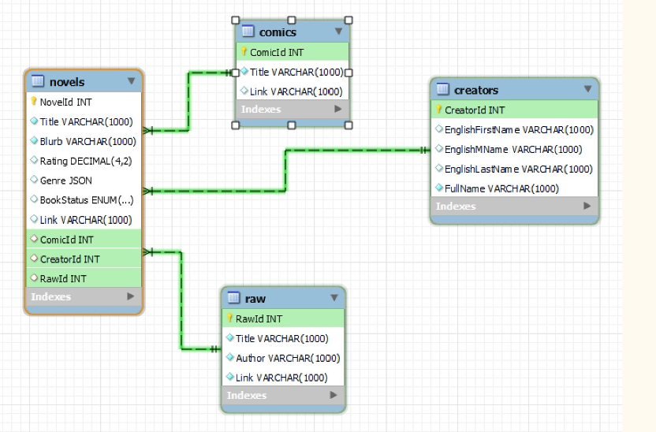

### ER Diagram for Final API
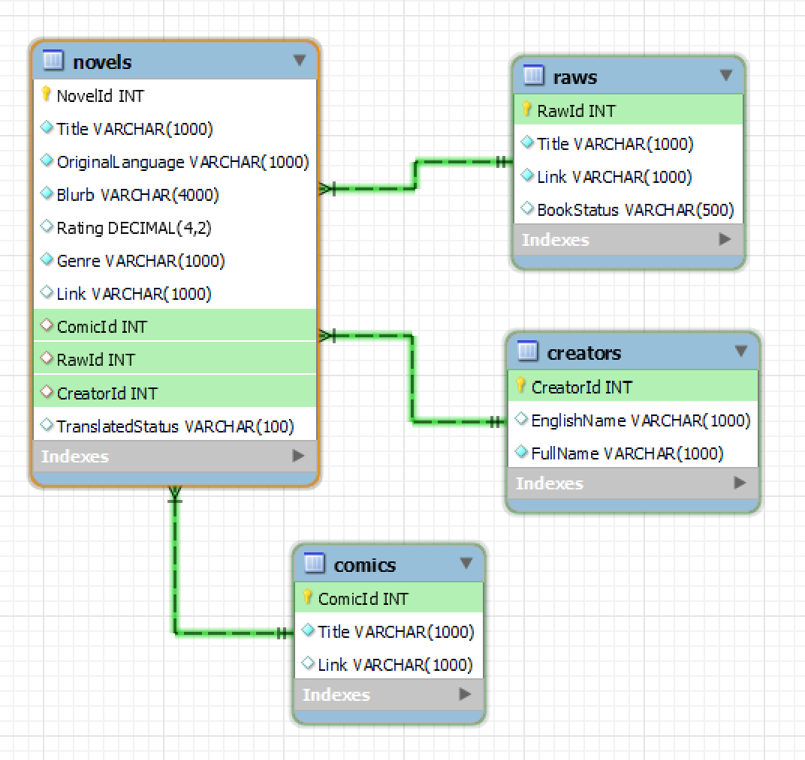

### Sql Code used to Create Database
Please note: I only added the SQL code for the first instance of entering data into the 4 tables.
```
CREATE DATABASE Lightnovels;

USE Lightnovels;

CREATE TABLE Novels (
    NovelId INT NOT NULL AUTO_INCREMENT,
    Title VARCHAR(1000) NOT NULL,
    OriginalLanguage VARCHAR(1000) NOT NULL,
    Blurb VARCHAR(4000) NOT NULL,
    Rating DECIMAL(4, 2) NULL,
    Genre VARCHAR(1000) NOT NULL,
    Link VARCHAR(1000) NULL,
    PRIMARY KEY (NovelId)
); 

CREATE TABLE Comics (
    ComicId INT NOT NULL AUTO_INCREMENT,
    Title VARCHAR(1000) NOT NULL,
    Link VARCHAR(1000) NULL,
    PRIMARY KEY (ComicId)
);

CREATE TABLE Raws (
    RawId INT NOT NULL AUTO_INCREMENT,
    Title VARCHAR(1000) NOT NULL,
    Link VARCHAR(1000) NOT NULL,
    BookStatus VARCHAR(500) NULL,
    PRIMARY KEY (RawId)
);

CREATE TABLE Creators (
    CreatorId INT NOT NULL AUTO_INCREMENT,
    EnglishName VARCHAR(1000) NULL,
    FullName VARCHAR(1000) NOT NULL,
    PRIMARY KEY (CreatorId)
);

ALTER TABLE Novels ADD COLUMN ComicId INT;
ALTER TABLE Novels ADD CONSTRAINT FK_NovelComic FOREIGN KEY (ComicId) References Comics(ComicId);
ALTER TABLE Novels ADD COLUMN RawId INT;
ALTER TABLE Novels ADD CONSTRAINT FK_NovelRaw FOREIGN KEY (RawId) References Raws(RawId);
ALTER TABLE Novels ADD COLUMN CreatorId INT;
ALTER TABLE Novels ADD CONSTRAINT FK_NovelCreator FOREIGN KEY (CreatorId) References Creators(CreatorId);
ALTER TABLE Novels ADD COLUMN TranslatedStatus VARCHAR(500);

INSERT INTO `lightnovel`.`novels` (`Title`, `OriginalLanguage`, `Blurb`, `Rating`, `Genre`, `Link`, `ComicId`, `RawId`, `CreatorId`, `TranslatedStatus`) VALUES ('I Attacked Because I Was Afraid Of Death', 'Chinese', 'Chi Xin was afraid of death but was convinced by her roommate to watch a newly released doomsday movie. At first glance, she was attracted by the handsome, calm, and resolute male lead.  When the tide of zombies flooded the city, the male protagonist stood on the wall with a sad smile and raised his gun. And when the camera closed up on a scarlet mouth that took the entire screen, Chi Xin screamed and fainted in shock.  When she opened her eyes again, the city wall under her feet was shaking and countless zombies rushed to bite her neck. A desert eagle in her hand, she trembled and almost fell off the wall. When she turned her head, the face that had made her swoon a moment ago was looking at her with a cold smile.  \"Chi Xin, use your life to pay for this mistake.\"  Chi Xin: Frightened to the extreme but expressionless.jpg  She remembered the voice of the self-proclaimed troublemaker system when she closed her eyes: [The doomsday world is highly difficult. The host can choose to add defense, attack, foresight, or other functions...]  What did she answer?  \"Attack! Give me full attack!\"  Chi Xin was about to hug the hero\'s thigh and beg for forgiveness when a zombie came to bite her. She instinctively raised her gun and in the male protagonist\'s horrified eyes, she smashed the zombie\'s head with the butt of the gun.  Chi Xin: Blood!!!  Everybody saw her look sad (scared), stunned (scared), and silent (scared) as she shot the remaining zombies one by one in ruthlessly accurate headshots.  Everyone: Why did you pretend to be so weak!\"', '4.20', 'Action, Sci-fi, Comedy', 'https://www.wuxiaworld.eu/novel/i-attacked-because-i-was-afraid-of-death', '1', '1', '1', 'Hiatus');
INSERT INTO `lightnovel`.`comics` (`ComicId`, `Title`, `Link`) VALUES ('1', 'N/A', 'N/A');
INSERT INTO `lightnovel`.`creators` (`EnglishName`, `FullName`) VALUES ('Unknown', 'Unknown');
INSERT INTO `lightnovel`.`raws` (`Title`, `Link`, `BookStatus`) VALUES ('N/A', 'N/A', 'N/A');

```

### Information added to the Database - more information can be found in the csv files uploaded for each database
Please note all csv files were directly exported from mySQL workbench and the N/A or Unknown field in some data was added just in case this information
did not exist for the novel or this information was not known.

#### Comic
| Comic Id | Title | Link |
| :---  | :---| :--- |
| 1  | N/A | N/A |
| 2  | It's not easy to be a man after traveling to the future | https://mangabtt.com/manga/its-not-easy-to-be-a-man-after-travelling-to-the-future-3118 |
| 3  | The Death Mage Who Doesn’t Want a Fourth Time | https://readkomik.com/manga/the-death-mage-who-doesnt-want-a-fourth-time/ |
| 4  | I’m a Fake Saintess but the Gods are Obsessed | https://coffeemanga.io/manga/im-a-fake-saintess-but-the-gods-are-obsessed-online-reading-12/ |

#### Creator
| Creator Id | English Name | Full Name |
| :---  | :---| :--- |
| 1  | Unknown | Unknown |
| 2  | Densuke | デンスケ |
| 3  | Yongsa | 용사 |
| 4  | Gyaol | 갸올 |
| 5  | Zhuang Pan Kao Yu | 装盘烤鱼 |
| 6  | Junye | 준예 |
| 7  | Is It Cool | 凉否 |
| 8  | Madame Ru  | 汝夫人 |
| 9  | Hong Ci Bei | 红刺北 |

#### Raw
| Raw Id | Title | Link |
| :---  | :---| :--- |
| 1  | N/A | N/A |
| 2  | 즉사기 들고 게임 속으로 | https://novel.munpia.com/286880 |
| 3  | 악녀는 그림을 그린다 | https://page.kakao.com/content/58083098 |
| 4  | 四度目は嫌な死属性魔術師 | https://ncode.syosetu.com/n1745ct/ |
| 5  | 因为怕死就全点攻击了 | https://www.sto.cx/mbookintro-200109.html |
| 6  | 가짜 성녀인데 신들이 집착한다 | https://page.kakao.com/content/60022483 |
| 7  | 快穿攻略：撩男神100式 | https://m.xbiquge.tw/book/37500/ |
| 8  | 穿越未来之男人不好当  | https://book.qidian.com/info/3009194/ |
| 9  | 砸锅卖铁去上学 | https://www.sto.cx/book-197589-1.html |

#### Novel Data
```
| Novel Id | Title | Original Language | Blurb | Rating | Genre | Link | Comic Id | Raw Id | Creator Id | Translated Status |
| 1  | I Attacked Because I Was Afraid Of Death | Chinese | Chi Xin was afraid of death but was convinced by her roommate to watch a newly released doomsday movie. At first glance, she was attracted by the handsome, calm, and resolute male lead.  When the tide of zombies flooded the city, the male protagonist stood on the wall with a sad smile and raised his gun. And when the camera closed up on a scarlet mouth that took the entire screen, Chi Xin screamed and fainted in shock.  When she opened her eyes again, the city wall under her feet was shaking and countless zombies rushed to bite her neck. A desert eagle in her hand, she trembled and almost fell off the wall. When she turned her head, the face that had made her swoon a moment ago was looking at her with a cold smile.  "Chi Xin, use your life to pay for this mistake."  Chi Xin: Frightened to the extreme but expressionless.jpg  She remembered the voice of the self-proclaimed troublemaker system when she closed her eyes: [The doomsday world is highly difficult. The host can choose to add defense, attack, foresight, or other functions...]  What did she answer?  "Attack! Give me full attack!"  Chi Xin was about to hug the hero's thigh and beg for forgiveness when a zombie came to bite her. She instinctively raised her gun and in the male protagonist's horrified eyes, she smashed the zombie's head with the butt of the gun.  Chi Xin: Blood!!!  Everybody saw her look sad (scared), stunned (scared), and silent (scared) as she shot the remaining zombies one by one in ruthlessly accurate headshots.  Everyone: Why did you pretend to be so weak! | 4.2 | Action, Sci-fi, Comedy | https://www.wuxiaworld.eu/novel/i-attacked-because-i-was-afraid-of-death | 1 | 5 | 5 | Hiatus |
| 2  | I Fell into the Game with Instant Kill | Korean |  I fell into a game world out of nowhere with an instant kill skill. | 4.0 | Action, Adventure, Comedy, Fantasy, Mystery | https://galaxytranslations97.com/novel/i-fell-into-the-game-with-instant-kill/ | 1 | 2 | 4 | Ongoing |
| 3  | A Painting of the Villainess as a Young Lady | Korean | A villainess known by all as a wicked woman who has done all sorts of evil deeds—Ducal Lady Violet. She regained her memories of her previous life after she fell into a lake and almost died. The very moment she woke up, she immediately visited her father, Duke Everett, and asked one thing.  “Please confine me to the annex.”  And so, she imprisoned herself there. Now that Violet was secluded away from the world’s criticism and reproach, She immersed herself in her previous life’s memories and started painting them.  “What the hell are you up to this time?”  Everyone was suspicious of just what she might be scheming. However, the misunderstandings surrounding her gradually got resolved one at a time… | 4.3 | Drama, Fantasy, Romance | https://peachesatdusk.com/apv/ | 1 | 3 | 3 | Ongoing |
| 4  | The Death Mage Who Doesn’t Want a Fourth Time | Japanese | Amamiya Hiroto is unlucky. His life consisted of misfortune after misfortune, culminating in an unlucky death during an incident on a school boat trip, trying to save a girl he barely knew. After death, he met a god of reincarnation who requested that the hundred or so dead passengers—one of them being the girl he tried in vain to save—be reincarnated into another world.  Yet a series of unfortunate events forced Hiroto to reincarnate with even less luck than before, starting with nothing but a tremendous amount of Mana. His second life, far worse than his first, came to a cruel end.  However, upon meeting the god a second time, he was informed that there would be yet another reincarnation—one that had already been set in motion and could not be stopped. Not wanting Hiroto to live long, the god cursed him before he was reborn in the hopes that he would either die quickly or commit suicide.  Hiroto was reborn once more as a half-Vampire, half-Dark Elf. A Dhampir. Not wanting a fourth life, he is determined to live this third life with the only things remaining from his previous lives—death-attribute magic and his enormous Mana pool. | 4.2 | Action, Adventure, Comedy, Fantasy, Harem, Mature, Seinen, Supernatural | https://lightnovelbastion.com/novel/death-mage/ | 3 | 4 | 2 | Ongoing |
| 5  | I’m a Fake Saintess but the Gods are Obsessed | Korean | I possessed a fake saintess who was going to die when the real saint appeared five years later. | 4.0 | Comedy, Fantasy, Harem, Romance | https://readhive.org/series/136/ | 4 | 6 | 6 | Completed |
| 6  | 100 Ways to Get the Male God | Chinese | The devilishly, charming villain’s lips curled up and he said: “Kiss me, hug me, hold me.”  The cold, icy beauty’s eyelashes lowered slightly: “You said you would marry me, you can’t take it back.”  The yandere youngster’s eyes were deep and dark, raising his eyebrows and laughing softly: “Other than by my side, where do you still want to go?”  …… Yu Chu felt helpless and could only ask for help from the Main God: “My Lord, your soul shards are always flirting with me, but I don’t want to be flirted with, what do you think I should do about it– Huh? Yeah, I really don’t want to be flirted with.”  “Hey, wait wait….. Don’t be angry, hey, don’t feel wronged either, holy crap, don’t act cute and spoiled—okay okay, I’ll let you flirt, I’ll let you flirt alright??” | 4.2 | Adventure, Comedy, Fantasy, Mature, Romance, School Life | https://euphoria-airlines.com/manga/100-ways-to-get-the-male-god/ | 1 | 7 | 7 | Hiatus
| 7  | Crossing to the Future, it’s Not Easy to Be a Man | Chinese | After dying from a strange terminal illness, Ling Lan was reborn into a world 10,000 years into the future. Although she dearly wished she could just live a peaceful and uneventful life in her new healthy body, fate had other plans…  Forced to disguise herself as a boy just so she could inherit her deceased father’s premium military benefits, Ling Lan’s journey to adulthood was full of challenges. After much difficulty, she finally turned sixteen when she could drop the charade. But before she could grasp her newfound freedom to get married and start her own family, a twist of fate results in her being thrown into the Federation’s top military boys’ school.  With these twists of fate, Ling Lan had little choice but to walk further and further down a path of no return, one of cold and aloof dominance… | 4.5 | Action, Adventure, Comedy, Josei, Mecha, Sci-fi | https://www.webnovel.com/book/it's-not-easy-to-be-a-man-after-travelling-to-the-future_8534263705001005 | 2 | 8 | 8 | Hiatus |
| 8  | Smash All Pots and Pans To Go to School  | Chinese | The former top engineering student Wei San transmigrated into an interstellar child who was deprived of education. By picking up garbage and turning waste into treasure, she finally saved a sum of money before the opening season of school and immediately signed up.  She planned to become a Mecha Engineer in the future. It was said that it can make a lot of money and was closely related to her own original specialization. Plan pass √  Unexpectedly, because of her greed for cheap tuition fees, Wei San reported to the wrong major and became a mecha individual fighter——those violent maniacs who licks blood all day  Wei·Gentle & Quiet·Impoverished·Engineer: “……”  However, the environment could not make her give in, and Wei San decided to learn by herself in her spare time.  During the training period of a certain competition, the media interviewed and photographed the individual fighters of each school in turn, which was broadcast live on the whole interstellar network. The audience could see that everyone was training desperately, such as gravity pressurization, close combat, long-distance entanglement and so on.  【YY’s melee is too strong. Who dares to melee when the light saber is out!】  【ww’s whipping skills are too superb, NB(F****** great)! ! !】  Then Wei San was recorded sitting cross legged in the training hall, looking down and concentrating on reading a book.  【What’s that Wei San looking at?】  As the camera zoomed in, the cover of the book in Wei San’s hand was immediately seen clearly by the whole star network: “Qing Fei teaches you to become a mecha master in 21 days”  Audience：……  As long as one hears the title of the novel, they could tell it wasn’t read by serious people.  The next day, the star net headline: A military academy student was overwhelmed and mentally disordered during training, trying to change careers. | 4.6 | Action, Comedy, Mecha, Romance, School Life, Sci-fi | https://bobateatranslations.com/projects/smash-all-pots-and-pans-to-go-to-school-sapps/ | 1 | 9 | 9 | Ongoing |
```
## API endpoints and HTTP methods
### Please note: My API does not need PostMan or similar applications to run as these methods have been built into the application itself. Please use the website to modify any data as some HTTP methods that work on the website may not work on PostMan.


* returns all the novels in the database and displays it as a table 


* gets the information for NovelId 2, please note 2 can be replaced by any other number


* creates a new novel in the database


* the GET method for the same API endpoint will return the webpage that asks user to enter information for the new novel


* updates the information for a novel in the database with NovelId 5, note 5 can be replaced by other numbers


* the GET method for the same API endpoint will return the webpage that asks user the user to put in the data that needs to be updated into the database


* deletes the novel with NovelId 5 from the database, note 5 can be replaced by other numbers


* the GET method for the same API endpoint returns a page that asks user if they want to delete this novel

## BookAPI - How Does it Look?
### HomePage
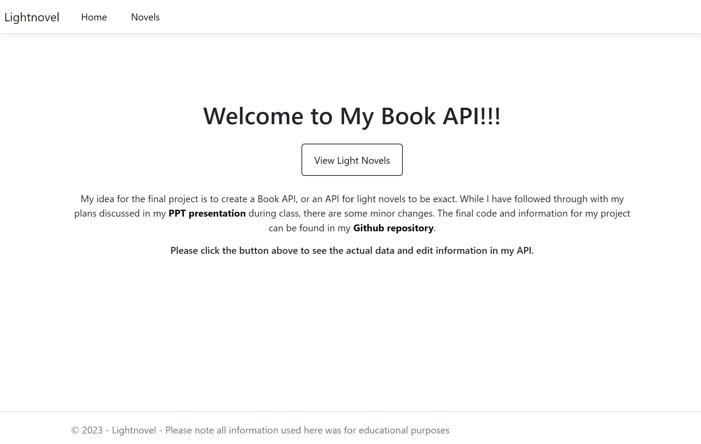

### BookAPI - GET method for all novels
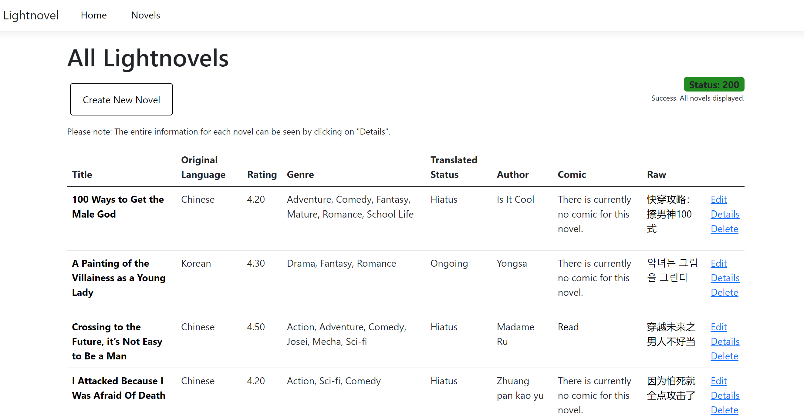

### GET method of one novel


### POST method for adding new novel
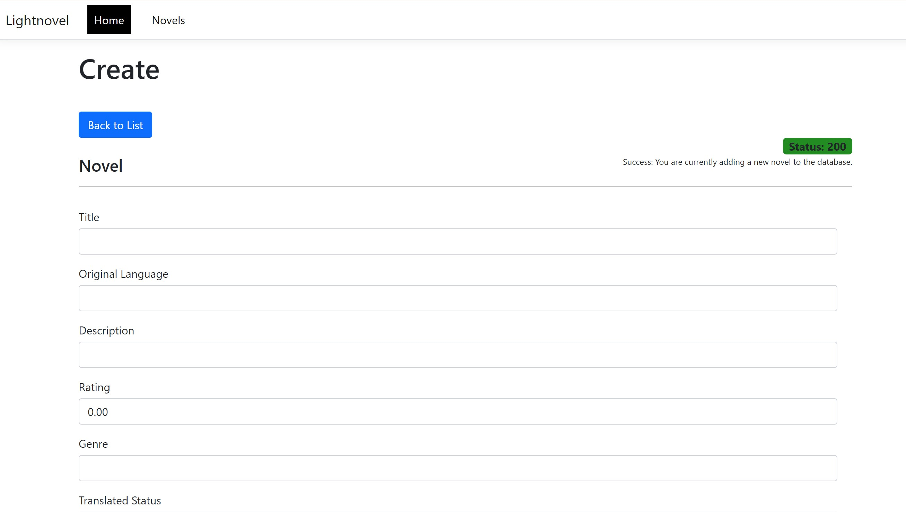
#### After submitting data to create new novel, please press button to go back
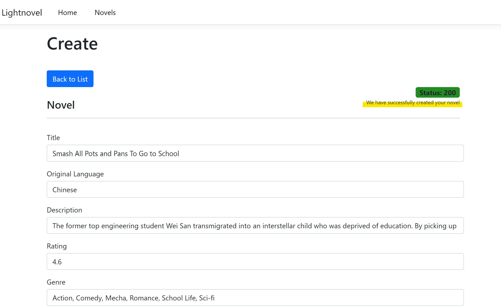

### PUT method
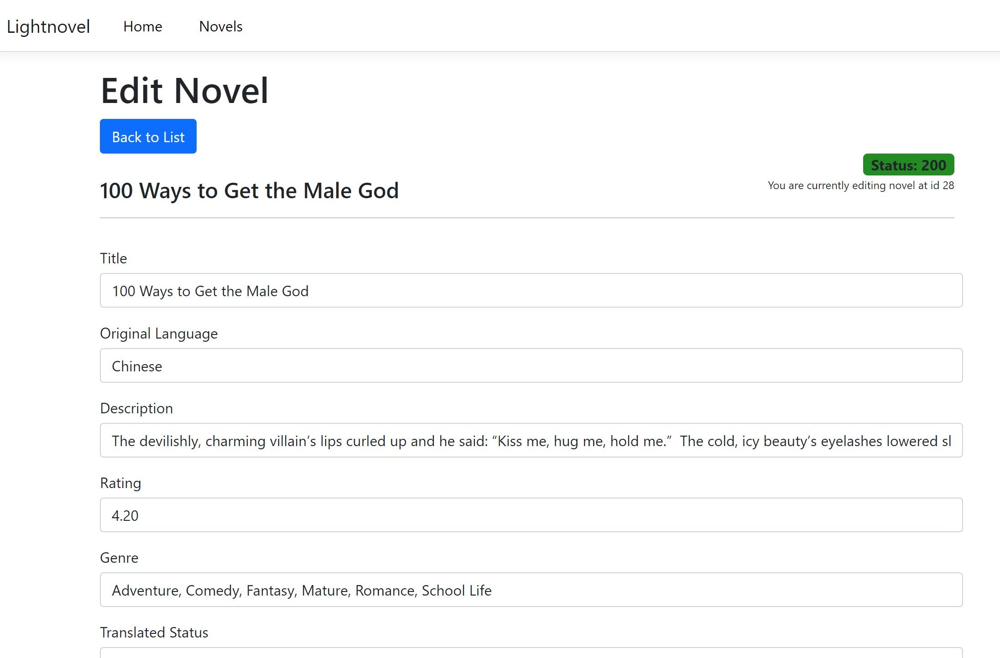
#### After submitting changes, please press the button to go back to List
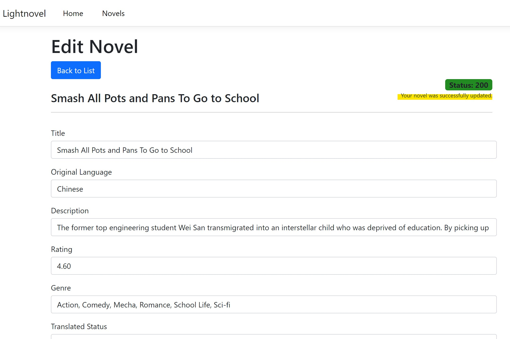

### Delete method
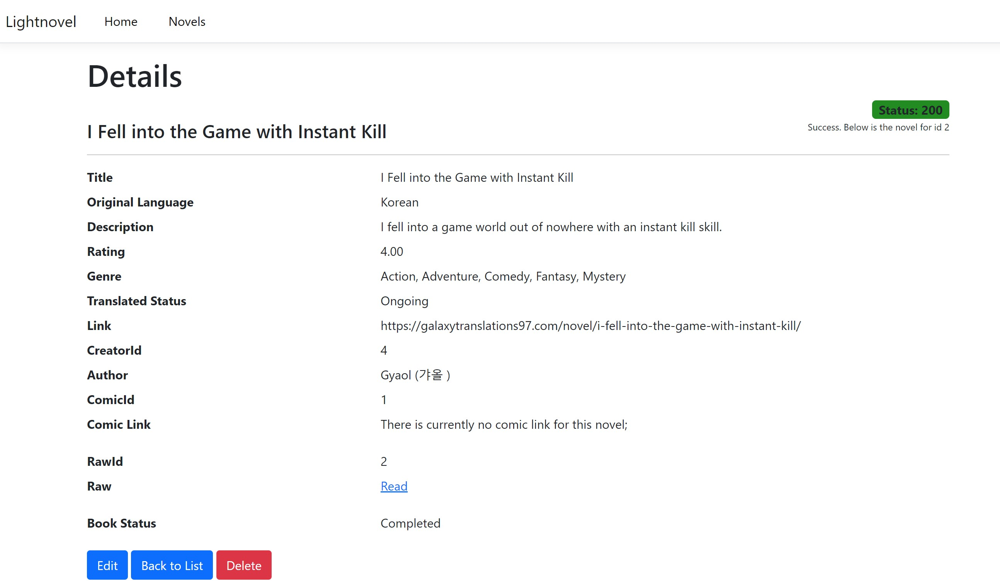
#### After deleting, please press the button to go back
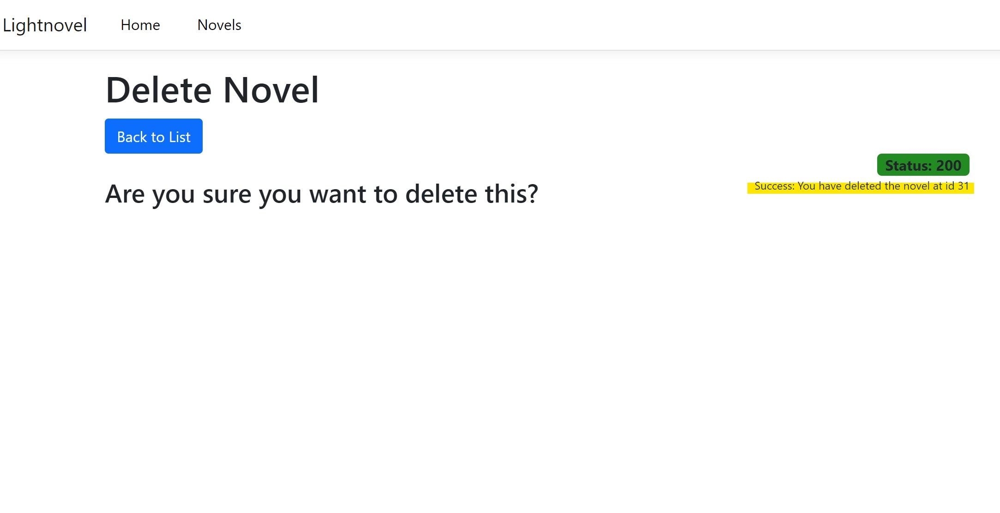

### Errors - This is how errors would show on webpage
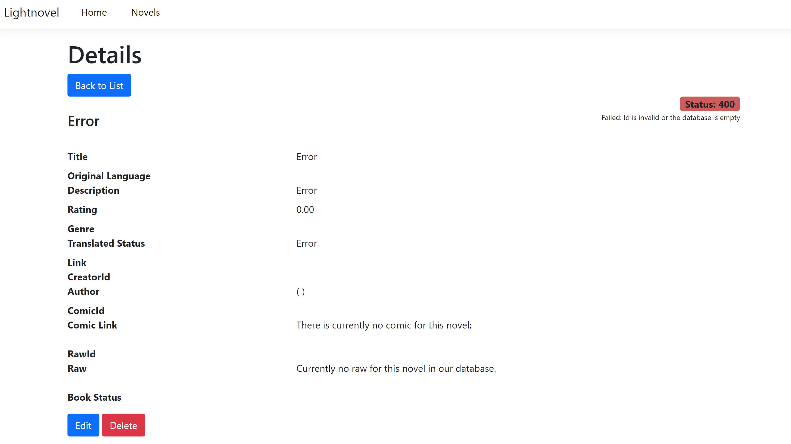
