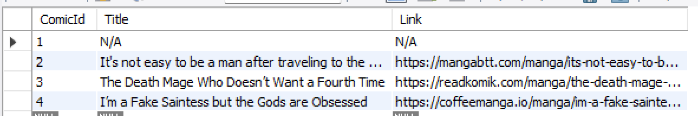
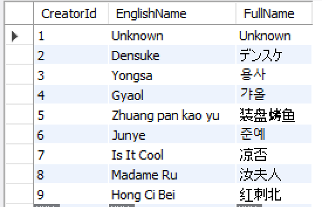
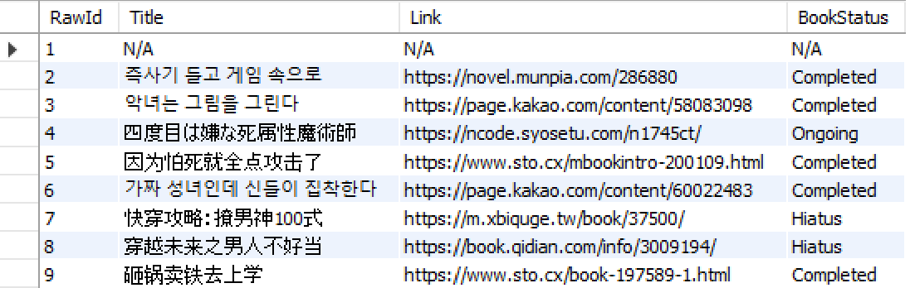
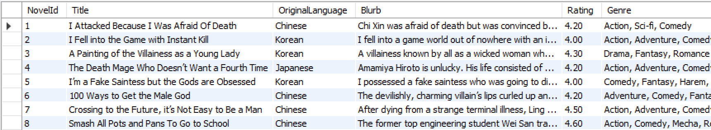

# CSCI-39537-Intro-to-API - Final Project - Book API

My final project is to create a Book API holding informations for some light novels. The initial plan of my final project can be found in my [PPT presentation](https://github.com/akthyang/CSCI-39537-Intro-to-API/blob/d270cd0dc63f693939236eb7c942aaff32f26037/Book%20API%20-%20Lightnovels.pdf). The information that was added to my database was found by using [Google](https://www.google.com/) and [NovelUpdates](https://www.novelupdates.com/). Some issues with my BookAPI is that it is completely dependant on the information inputted by the user into the database. There is currently no way for the database to check if the database is the desired info.

## Database

### ER Diagram of Initial Plan for API


### ER Diagram for Final API


### Sql Code used to Create Database
Please note: I only added the SQL code for the first instance of entering data into the 4 tables.
```
CREATE DATABASE Lightnovels;

USE Lightnovels;

CREATE TABLE Novels (
    NovelId INT NOT NULL AUTO_INCREMENT,
    Title VARCHAR(1000) NOT NULL,
    OriginalLanguage VARCHAR(1000) NOT NULL,
    Blurb VARCHAR(4000) NOT NULL,
    Rating DECIMAL(4, 2) NULL,
    Genre VARCHAR(1000) NOT NULL,
    Link VARCHAR(1000) NULL,
    PRIMARY KEY (NovelId)
); 

CREATE TABLE Comics (
    ComicId INT NOT NULL AUTO_INCREMENT,
    Title VARCHAR(1000) NOT NULL,
    Link VARCHAR(1000) NULL,
    PRIMARY KEY (ComicId)
);

CREATE TABLE Raws (
    RawId INT NOT NULL AUTO_INCREMENT,
    Title VARCHAR(1000) NOT NULL,
    Link VARCHAR(1000) NOT NULL,
    BookStatus VARCHAR(500) NULL,
    PRIMARY KEY (RawId)
);

CREATE TABLE Creators (
    CreatorId INT NOT NULL AUTO_INCREMENT,
    EnglishName VARCHAR(1000) NULL,
    FullName VARCHAR(1000) NOT NULL,
    PRIMARY KEY (CreatorId)
);

ALTER TABLE Novels ADD COLUMN ComicId INT;
ALTER TABLE Novels ADD CONSTRAINT FK_NovelComic FOREIGN KEY (ComicId) References Comics(ComicId);
ALTER TABLE Novels ADD COLUMN RawId INT;
ALTER TABLE Novels ADD CONSTRAINT FK_NovelRaw FOREIGN KEY (RawId) References Raws(RawId);
ALTER TABLE Novels ADD COLUMN CreatorId INT;
ALTER TABLE Novels ADD CONSTRAINT FK_NovelCreator FOREIGN KEY (CreatorId) References Creators(CreatorId);
ALTER TABLE Novels ADD COLUMN TranslatedStatus VARCHAR(500);

INSERT INTO `lightnovel`.`novels` (`Title`, `OriginalLanguage`, `Blurb`, `Rating`, `Genre`, `Link`, `ComicId`, `RawId`, `CreatorId`, `TranslatedStatus`) VALUES ('I Attacked Because I Was Afraid Of Death', 'Chinese', 'Chi Xin was afraid of death but was convinced by her roommate to watch a newly released doomsday movie. At first glance, she was attracted by the handsome, calm, and resolute male lead.  When the tide of zombies flooded the city, the male protagonist stood on the wall with a sad smile and raised his gun. And when the camera closed up on a scarlet mouth that took the entire screen, Chi Xin screamed and fainted in shock.  When she opened her eyes again, the city wall under her feet was shaking and countless zombies rushed to bite her neck. A desert eagle in her hand, she trembled and almost fell off the wall. When she turned her head, the face that had made her swoon a moment ago was looking at her with a cold smile.  \"Chi Xin, use your life to pay for this mistake.\"  Chi Xin: Frightened to the extreme but expressionless.jpg  She remembered the voice of the self-proclaimed troublemaker system when she closed her eyes: [The doomsday world is highly difficult. The host can choose to add defense, attack, foresight, or other functions...]  What did she answer?  \"Attack! Give me full attack!\"  Chi Xin was about to hug the hero\'s thigh and beg for forgiveness when a zombie came to bite her. She instinctively raised her gun and in the male protagonist\'s horrified eyes, she smashed the zombie\'s head with the butt of the gun.  Chi Xin: Blood!!!  Everybody saw her look sad (scared), stunned (scared), and silent (scared) as she shot the remaining zombies one by one in ruthlessly accurate headshots.  Everyone: Why did you pretend to be so weak!\"', '4.20', 'Action, Sci-fi, Comedy', 'https://www.wuxiaworld.eu/novel/i-attacked-because-i-was-afraid-of-death', '1', '1', '1', 'Hiatus');
INSERT INTO `lightnovel`.`comics` (`ComicId`, `Title`, `Link`) VALUES ('1', 'N/A', 'N/A');
INSERT INTO `lightnovel`.`creators` (`EnglishName`, `FullName`) VALUES ('Unknown', 'Unknown');
INSERT INTO `lightnovel`.`raws` (`Title`, `Link`, `BookStatus`) VALUES ('N/A', 'N/A', 'N/A');

```

### Information added to the Database - more information can be found in the csv files uploaded for each database
Please note all csv files were directly exported from mySQL workbench and the N/A or Unknown field in some data was added just in case this information
did not exist for the novel or this information was not known.

#### Comic


#### Creator


#### Raw


#### Sample of Novel Data


## API endpoints and HTTP methods
### Please note: My API does not need PostMan or similar applications to run as these methods have been built into the application itself. Please use the website to modify any data as some HTTP methods that work on the website may not work on PostMan.


* returns all the novels in the database and displays it as a table 


* gets the information for NovelId 2, please note 2 can be replaced by any other number


* creates a new novel in the database


* the GET method for the same API endpoint will return the webpage that asks user to enter information for the new novel


* updates the information for a novel in the database with NovelId 5, note 5 can be replaced by other numbers


* the GET method for the same API endpoint will return the webpage that asks user the user to put in the data that needs to be updated into the database


* deletes the novel with NovelId 5 from the database, note 5 can be replaced by other numbers


* the GET method for the same API endpoint returns a page that asks user if they want to delete this novel

## BookAPI - How Does it Look?
### HomePage


### BookAPI - GET method for all novels


### GET method of one novel


### POST method for adding new novel

#### After submitting data to create new novel, please press button to go back


### PUT method

#### After submitting changes, please press the button to go back to List


### Delete method

#### After deleting, please press the button to go back


